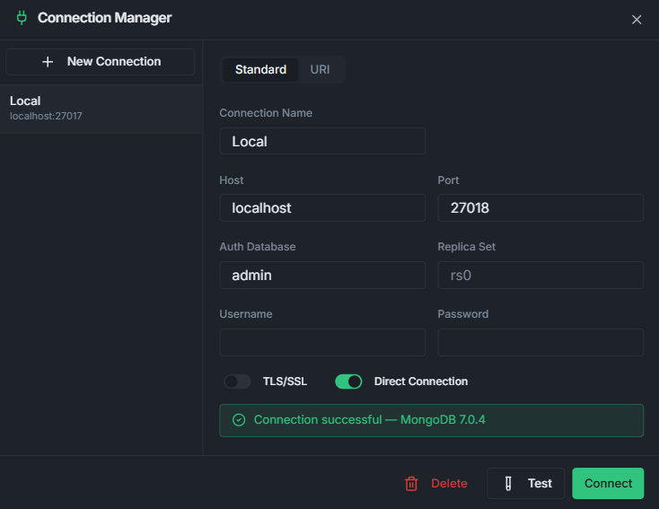
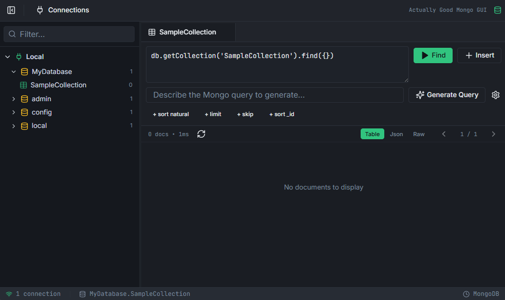
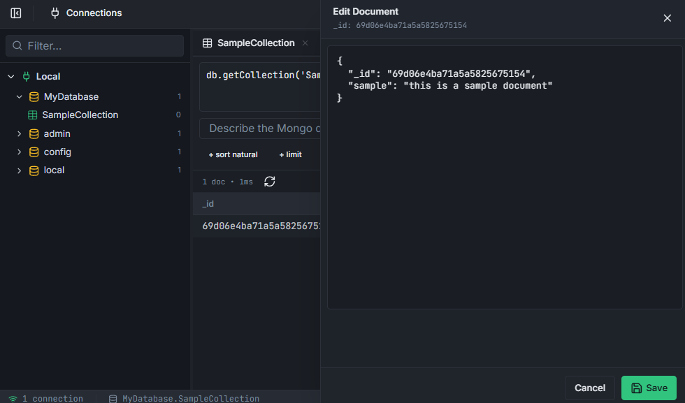
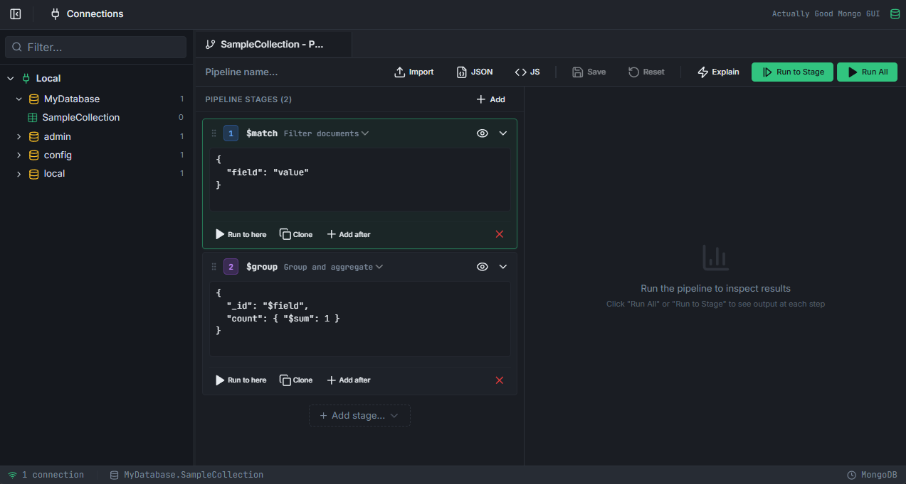
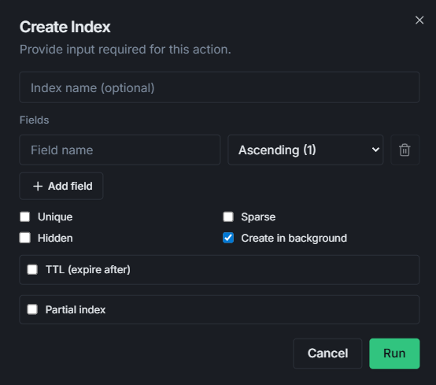
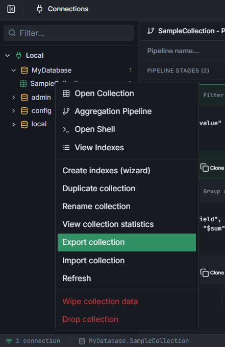
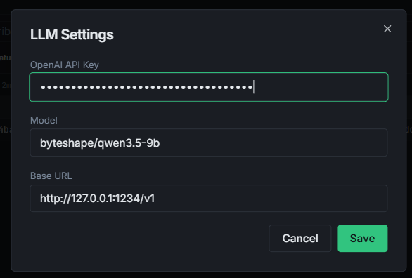
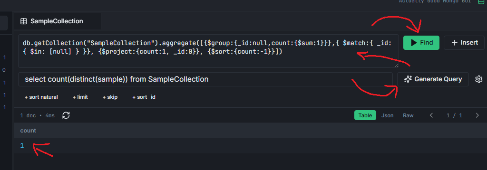

# Actually Good Mongo GUI

MongoDB GUI that prioritizes real workflows over paywalls.

This project is a work in progress. Features are usable today, but the UI/UX and edge-case handling are still improving fast.

## Why This Exists

- Free and open alternative for day-to-day MongoDB work
- Practical tools for browsing, querying, editing, indexing, and aggregating
- Desktop app packaging for people who want a local install
- No feature gating behind paid tiers (66 75 63 6B 20 73 74 75 64 69 6F 33 74)

## Core Features

- Multi-connection MongoDB explorer
- Database and collection management actions
- Collection data grid with filter/sort/limit/projection controls
- Document create/edit/delete with JSON editor drawer
- Aggregation pipeline builder with staged results
- Index management (create/drop/list)
- Mongo shell tab for ad-hoc commands
- Import and export flows
- AI-assisted query generation (configurable provider/settings)
- Desktop distribution for Windows, macOS, and Linux

## Screenshot Placeholders

### 1. Main Workspace (Explorer + Tabs)

### 2. Connection Dialog

### 3. Collection Data Grid

### 4. Document Drawer (Create/Edit JSON)

### 5. Aggregation Pipeline Builder

### 6. Indexes Management

### 7. Import / Export Actions

### 8. AI Query Generation

## Project Status

- Current state: usable for real work
- Stability: improving each iteration
- Direction: keep shipping practical features that remove friction

## Contributing

Bug reports and PRs are welcome. If something sucks, open an issue and be direct.

In progress!
